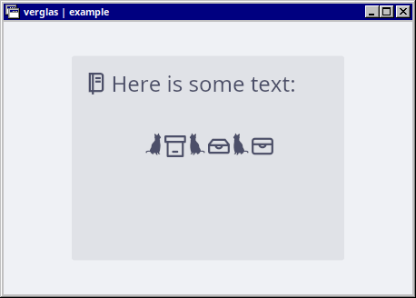

# verglas

[](https://docs.rs/verglas)
[](https://crates.io/crates/verglas)
[](https://github.com/kardwen/verglas/blob/main/LICENSE)
[](https://crates.io/crates/verglas)

🧊 Iced SVG icon font generator

## Introduction

This crate can be added as a build dependency to automatically generate a TrueType font (`.ttf` file) from SVG icons in a directory for use with the [Iced](https://github.com/iced-rs/iced) GUI library. Essentially, it aims to provide the functionality of [`svg2tff`](https://github.com/fontello/svg2ttf) as a pure Rust library.

*This library is currently experimental.*

For more details, please have a look at the [documentation](https://docs.rs/verglas).

The name "verglas" refers to a thin layer of transparent ice that forms on surfaces under certain climatic conditions.

## Example

The [`example`](https://github.com/kardwen/verglas/tree/main/example) showcases how different SVG icon sets (in particular a subset of [Jam icons](https://github.com/michaelampr/jam) and some custom icons) can be combined into a font and loaded in an Iced app.



Build and run the example with:

```sh
cargo run --locked --package example
```

## Development

Contributions are very welcome!

While I initially developed `verglas` for Iced, I hope it will be useful for other use cases that I haven't thought of yet.

Libraries used:

* [usvg](https://github.com/linebender/resvg/tree/main/crates/usvg) for parsing and simplifying SVG files
* [kurbo](https://github.com/linebender/kurbo) for converting cubic Bézier curves to quadratic Bézier curves
* Crates from the [fontations](https://github.com/googlefonts/fontations) project for reading and writing fonts

More helpful links:

* [FontForge](https://fontforge.org/)
* [Rust API Guidelines](https://rust-lang.github.io/api-guidelines/)

Notes:

* Set flag `--all-features` for cargo commands to activate all features of all packages
